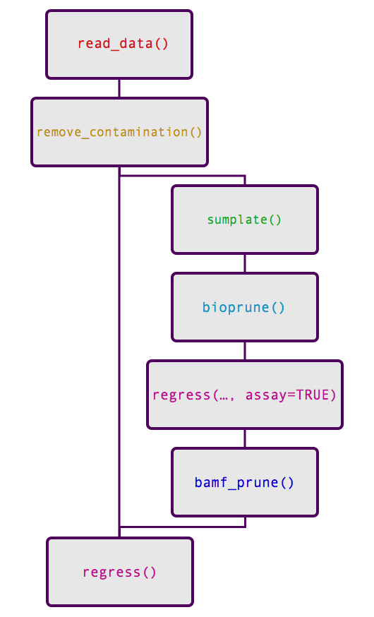

# easysorter

easysorter is effectively version 2 of the COPASutils package (Shimko and Andersen, 2014). This package is specialized for use with worms and includes additional functionality on top of that provided by COPASutils, including division of recorded objects by larval stage and the ability to regress out control phenotypes from those recorded in experimental conditions. The package is rather specific to use in the Andersen Lab and, therefore, is not available from CRAN. To install you will need the [`devtools`](https://github.com/hadley/devtools) package. You can install both the `devtools` package and easy sorter using the commands below:

```r
install.packages("devtools")
devtools::install_github("AndersenLab/easysorter")
```

The functionality of the package can be broken down into three main goals:

+ Reading raw data from the sorter alongside information about strains, conditions, controls, and contamination

+ Pruning anomalous data points

+ Regressing control phenotypes from experimental phenotypes

## Directory structure

Because so much information must be transferred alongside the plate data, the directory structure from which you are reading is critically important. Below is an example of a correct directory structure.

```
20150529_LysateScore/
├── conditions
│   └── LysateConc5-20.csv
├── contamination
│   ├── p01_contamination.csv
│   └── p02_contamination.csv
├── controls
│   └── None.csv
├── score
│   ├── p01_N2CBLysateTest_LysateConc5-20_None.txt
│   └── p02_N2CBLysateTest_LysateConc5-20_None.txt
└── strains
    └── N2CBLysateTest.csv
```

This directory exhibits the minimal file content and naming for the easysorter package to work.

### Experiment directory

The experiment directory contains all of the files attached to a specific experiment conducted on a specific date. The naming convention for these folders should include the date in the format 4-digit year::2-digit month::2-digit day and experiment name separated by underscores. Optionally, an experiment round and assay can be added as well. The round should be a number and the assay should be a lowercase letter. Because of the ambiguity of the experiment and round/assay, the experiment name should never contain numbers itself.

```
# Minimal directory name
# Date is January 1st, 2015
# Experiment name is "ExperimentName"

20150101_ExperimentName/

#####################################

# Maximum directory name
# Date is January 1st, 2015
# Experiment name is "ExperimentName"
# Round is 1
# Assay is A

20150101_ExperimentName1a/

#####################################

20150101_ExperimentName1a/ = GOOD
20150101_Experiment25Name1a/ = BAD
```

### Template directories

Each experiment directory should have four template directories: `strains`, `conditions`, `controls`, and `contamination`. Within each of these directories should be the template files in `.csv` format.

The blank template file can be downloaded [here](ADD DIRECTORY FOR DOWNLOAD). Each sheet of the file should be filled in and exported to a `.csv` individually. If you are using Excel, use File -> Save As... and select file format `.csv` to export the currently selected sheet only. This will need to be done multiple times to export each sheet. In Numbers, select File -> Export To... -> .CSV. This will export all of the sheets to different files within a folder. Each file will need to be renamed individually after they are exported.

#### Strains template

Enter the strain name for all wells. If the well contained no strain (a wash well, for instance), enter "NA".

#### Conditions template

Enter the condition name for each well. Multiple dosages can be encoded as `bleomycin-250` or `bleomycin 250`. Avoid using just numeric values like `250`.

#### Controls template

Enter the control for each well. If the well does not have an associated control, it should be encoded as `none`. If the well itself is a control well, encode the control value as `NA`.

#### Contamination

Enter the value for contamination in only wells that were contaminated. These should be encoded as `TRUE`. All non-contaminated wells can either be encoded as `FALSE`. Contamination files should be names as the plate number and the word "contamination", separated by an underscore. For example:

```
20150529_LysateScore/
├── conditions
│   └── LysateConc5-20.csv
├── contamination
│   ├── p01_contamination.csv
│   └── p02_contamination.csv
├── controls
│   └── None.csv
├── score
│   ├── p01_N2CBLysateTest_LysateConc5-20_None.txt
│   └── p02_N2CBLysateTest_LysateConc5-20_None.txt
└── strains
    └── N2CBLysateTest.csv
```

The contamination files in this directory are named `p01_contamination.csv` and `p02_contamination.csv`. These names correspond to the two numbers used on the two plates that were scored.

### File naming

File names should be formatted with the plate number, name of the strains template file, name of the conditions template file, and name of the controls template file all separated by underscores. All data files must be saved as `.txt` files. In the plate named `p01_N2CBLysateTest_LysateConc5-20_None.txt` `p01` is the plate number, `N2CBLysateTest` refers to the strain template file `N2CBLysateTest.csv`, `LysateConc5-20` refers to the condition template file `LysateConc5-20.csv`, and `None` refers to the control template file `None.csv`.


## Pipeline

The complete easy sorter package consists of only five functions: `read_data`, `sumplate`, `bamf_prune`, and `regress`.

### `read_data()`

`read_data()` can take as an argument a path to a single data file, a directory with sorter data files, or an experiment directory with both setup and score subdirectories. If the function is given either a single file or directory of files, it will output a single data frame of all of the data that were read. If the function is given an experiment directory with both setup and score subdirectories, it will output a two element list with the first element being the score data and the second element being the setup data.

For further information use the command `?read_plate` to access the documentation.

### `sumplate()`

`sumplate` summarizes the plates that have been read in to R using the `read_data` function. This function can take either a single data frame or the list of two data frames. If a list is passed, the `n.sorted` column will be calculated automatically using the setup data. Otherwise, n.sorted will be set to 0 and can be changed manually by the user.

For further information use the command `?sumplate` to access the documentation.

### `bamf_prune()`

`bamf_prune()` takes a summarized plate as input and outputs a plate data frame either with three additional columns indicating outlier calls or a trimmed data frame with all outliers removed.

For further information use the command `?bamf_prune` to access the documentation.

### `regress()`

`regress()` can take either a pruned or unpruned data frame and will return a data frame in long form with an added column consisting of the residuals from the linear fit (either `phenotype ~ control` or `phenotype ~ control + assay`).

For further information use the command `?regress` to access the documentation.

### Overview


